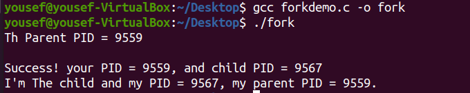

# Process Creation in Linux

Processes in operating systems form hierarchy. So a new process is always created by a parent process. The process that creates the new one is called the parent process, and the newly created process is called the child process.

## fork() System Call:
Process creation is achieved through the fork() system call.

**fork()** creates a new process by duplicating the calling process. The new process is referred to as the child process. The calling process is referred to as the parent process.

**Syntax:**
```c
#include <sys/types.h>
#include <unistd.h>

pid_t fork();
```

**Return Value:**
On success, the PID of the child process is returned in the parent, and 0 is returned in the child. On failure, -1 is returned in the parent, no child process is created, and errno is set appropriately.


**Example:**
```c
#include <sys/types.h>
#include <unistd.h>
#include <stdio.h>

int main ( ){
    printf("Th Parent PID = %d\n", getpid());

    int ret_pid = fork();

    if(ret_pid == -1){
        printf("Failed to create a new process\n") ;
    }
    else if(ret_pid>0) {
        printf("Success! your PID = %d, and child PID = %d\n", getpid(), ret_pid) ;
    }
    else if(ret_pid == 0) {
        printf("I'm The child and my PID = %d, my parent PID = %d. \n", getpid()getppid()) ;
    }
    return 0;

}
```
compile and run the above code:
```console
    gcc forkdemo.c -o fork
    ./fork
```

**output**



## execv() System Call:
The exec family of functions replaces the current running process with a new process. It can be used to run a C program by using another C program.

**Syntax:**
```c
#include <unistd.h>
int execve(const char *filename, char *const argv[], char *const envp[]); 
```
path: points to the file to be executed. 
argv[]: pointers to null-terminated strings that represent the argument vector available to the executed program. The first argument, by convention, should point to the filename associated with the file being executed.
envp[]: allow the caller to specify the environment of the executed program via the argument envp. 

**Return Value:**
The exec() functions only return if an error has occurred. The return value is -1, and errno is set to indicate the error. 

**Example:**
```c
#include <unistd.h>
#include <stdio.h>

int main (int argc, char *argv[]){
    
    printf("I'm the calling process.\n");

    char *newargv[] = {NULL};
    char *newenvp[] = {NULL};

    execve(argv[1], newargv, newenvp);

    printf("This text will be printed in case of failure.\n");
    return 0;
}
```
compile and run the above code:

```console
    gcc execdemo.c -o exec
    ./exec /usr/bin/ls
```

**output**


when you enter invalid path:

```console
    ./exec /usr/bin/invaild
```
**output**


## wait() System Call:
A call to wait() blocks the calling process until one of its child processes exits or a signal is received. After the child process terminates, parent continues its execution after wait system call instruction.

**Syntax:**
```c
#include <sys/wait.h>
#include <unistd.h>

// Waits for a child process to terminate and returns its PID
pid_t wait(int *stat_loc); 
```

- If the parent process has multiple children, the wait() call will cause the parent to wait until any child process terminates.
- If a child process terminates, wait() returns the PID of the terminated child.
- If multiple child processes terminate, wait() will reap any one of them arbitrarily and return its PID.
- If no children exist, wait() immediately returns -1.

