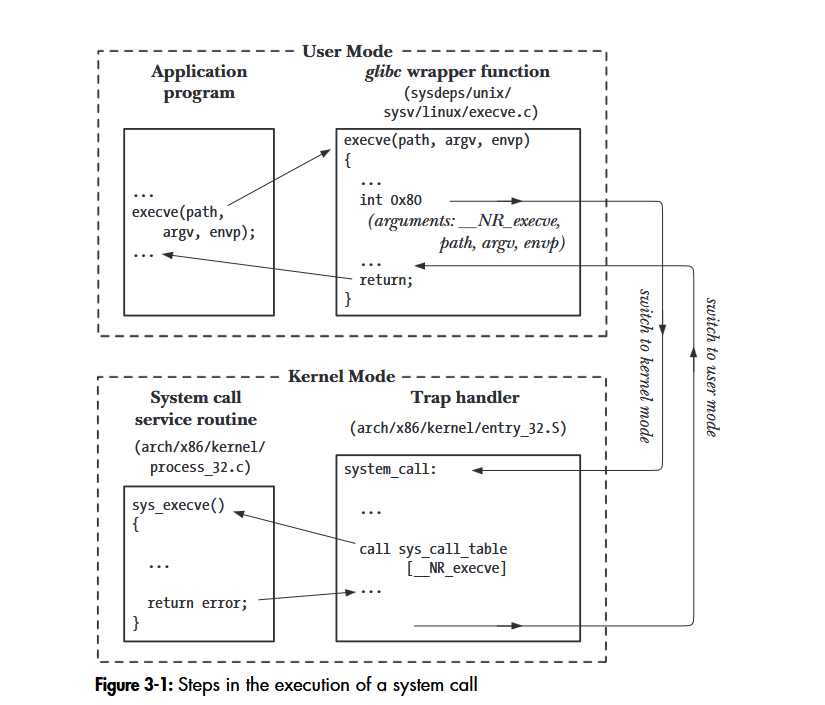

A **system call** is controlled or directed entry point into the kernel, allowing the process to ask the kernel to perform some action.

As the kernel provides a wide range of services via system calls interfaces, such as creating a new process, performing I/O and inter process communication ..etc.

some facts about system calls:

- a System call changes the processor state from the user mode to the kernel mode.
- the set of sys calls is fixed, ,and each is defined by a unique number.
- each system call may have set of arguments to specify some information to be transferred from user space to kernel space and also reads from the kernel space (*memory*) or to direct the execution.

## Calling a system call:
Usually, system calls are not invoked directly: instead, most system calls have corresponding C library  wrapper  functions which  perform  the  steps  required (e.g., trapping to kernel mode) in order to invoke the system call.  Thus, making a system call looks the same as invoking a normal library function.

In many cases, the C library wrapper function does nothing more than:

-  copying arguments and the unique system call number to the registers where the kernel expects them.
   -  trapping to kernel mode, at which point the kernel does the real work of the system call.
   -  setting <u>errno</u> if the system call returns an error number when the kernel returns the CPU to user mode.
However, in a few cases, a wrapper function may do rather more than this, for example, performing some preprocessing  of the  arguments  before  trapping to kernel mode, or postprocessing of values returned by the system call.

so invoking a sys call just invoking a C function, but behind the scenes, there is much to know! 

## Steps:
1. The process makes a system call by calling C wrapper function.
2. the wrapper function process the arguments and makes them available to the system call, these args are passed in the stack but the kernel expects them in some registers so the wrappers copies them to these registers.
3. since all the system calls are called the same way, the kernel needs some method of identifying the system calls, so the wrapper function copies the system call number to a specific CPU register.
4. then the wrapper function executes trap machine instruction (int 0x80), which causes the processor to switch from user mode to kernel mode and execute code pointed to by location 0x80 - in x86-32 architecture -.
5. in response to the trap to location 0x80, the kernel invokes its *system_call()* to handle the trap, this handler:
	1. save register values onto the kernel stack.
	2. check the validity of the system call number.
	3. Invokes the appropriate system call service routine, which is found by using the system call number to index a table of all system call service routines (the kernel variable *sys_call_table*). and if the system call service routine have any arguments it first check their validity, the the service routine performs the required task which may include transferring data between user memory and kernel memory, finally the service routine returns a result status to the *system_call()* routine.
	4. Restores register values from the kernel stack and places the system call return value on the stack.
	5. Returns to the wrapper function, simultaneously returning the processor to user mode.

